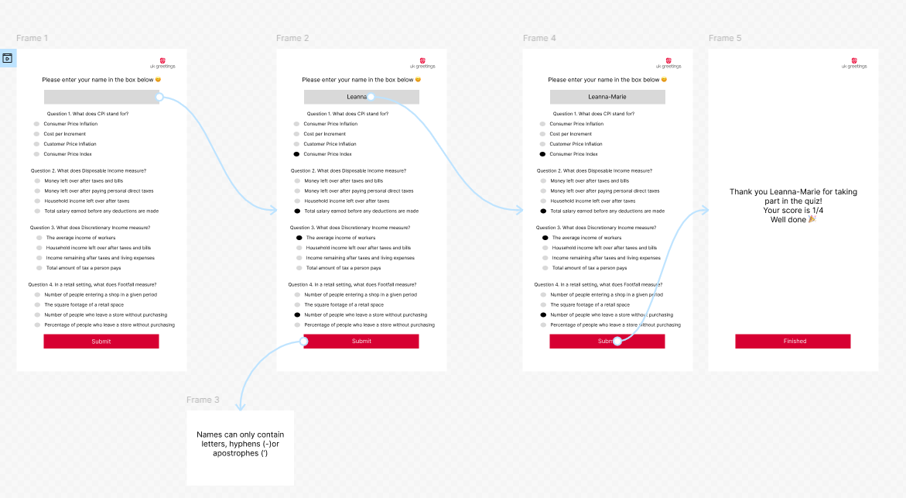
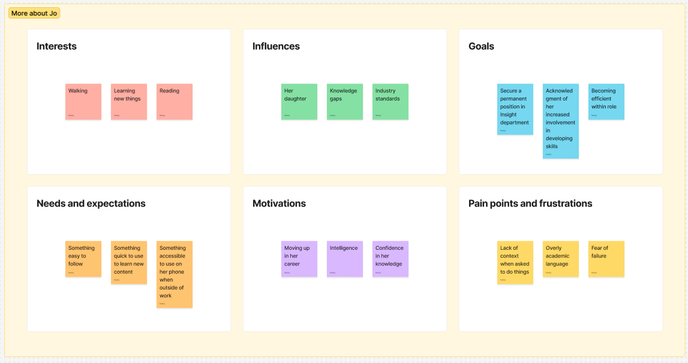
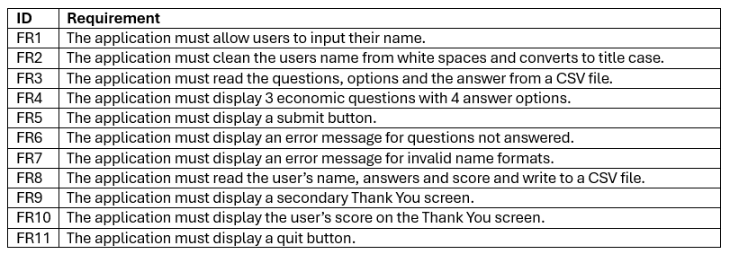
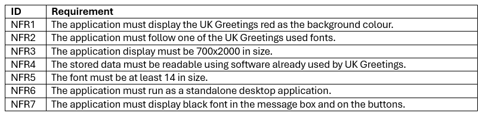

# Economic Quiz App

## Introduction

I work at UK Greetings, we supply greetings cards to retailers across the UK. I work in the Consumer Insight department where we look at how economic factors correlate to the greetings card market. Knowledge on what is happening in the UK economy is imperative for our team. There are lots of economic jargon used, this can be tricky to remember what each economic indicator measures. Therefore, I decided to develop an Economic Quiz app to test my team on economic measures.

Economic quiz app is a desktop application built using python and tkinter. The app asks the user for their name and deploys 3 questions with multiple choice answers where the user can choose the answer. It is not intended to be a teaching tool; rather a short quiz created to see what the user already knows and is only 3 questions long as our department is very fast paced so anything longer would not be useful.

Before submission, if any questions are not answered the app displays an error message. This is a key component for my app because some of my team are less technical, having this error message ensures they know all questions have been answered so they don’t have to retake the quiz. The user’s name is cleaned and checked against 4 validation functions, if any of the validations are not met another error message is displayed before the user can proceed. This ensures the data stored is clear and easy to read, which is important when creating visualisations. When all questions are answered and the name is valid, the name, date, time, score and selected answers are written to a CSV file. This storage format is used across the business and is easily accessible. 

My app focuses on the input collection, validation and storage, features such as data visualisation have not taken place at this stage. 

## Design
### GUI

Figure 1 shows the Figma wireframe used at the beginning of the design stage of my quiz. It demonstrates the intended user journey throughout the quiz. Starting at entering the user’s name and answers, to an error message being displayed. Then submitting their valid name and all answers. Then displaying the Thank you screen where their score is present, the user can press the quit button.

This Figma was used to display the screen layout, input validation and flow before implementation. It does not represent the final interface of the app; I adjusted based on the screen layout present with a laptop.

**Figure 1:** Wireframe

### Persona File

I created a persona file (Figure 2) to document an intended user, this allowed me to think further about the needs of the user. For example, I ensured my app was able to be displayed on a laptop screen as I know my intended user uses a laptop. This adheres to the user and business needs.

**Figure 2:** Persona File

### Functional and Non-functional Requirements
#### Functional Requirements

**Figure 3:** Functional Requirements

#### Non-functional Requirements

**Figure 4:** Non-functional Requirements

### Tech Stack Outline
•	Python 3 - programming language used.
•	Tkinter – desktop graphical user interface.
•	csv – local data storage.
•	re – regular expression for input validation.
•	datetime – timestamp generation.
•	unittest – automated unit testing.
•	message box – widget that allows user input for name.

### Code Design Document
This is a class diagram that demonstrates the relationship between the parent and child.

**Figure 5:** Class Diagram

## Development Section

I am going to display my development process as technical documentation as it delivers the same steps.

### Technical Documentation 

#### Introduction
This document outlines the specifications and requirements to run the Economic Quiz app. The application is a desktop GUI:
•	Loads questions from a CSV file.
•	Presents them on the GUI.
•	Validates the input.
•	Stores the data.

#### Intended user
The intended user are colleagues who need a quick review on economic metrics. Displaying the score gives real time feedback on performance so the user can practice on areas of improvement.

#### How to run the app
The Economic Quiz app requires Python 3 to run.

## Testing Section
Once I developed my app, I did testing to ensure all code is running correctly. I first did manual tests on the name input. I did this by manually inputting different names with different formats into the message box to see if the error message appeared. As seen in Figure 6 most tests passed but the length check did not pass, so I went into my quiz_utils folder and realised my minimum length was actually 0 so I changed that to 2. I tested again and it passed. The skipped question test failed, there was no error message in my main.py for this so I added the skipped_question code. Once added the test passed.

