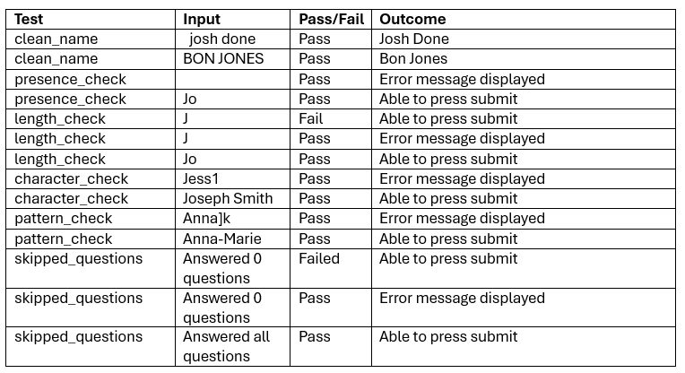
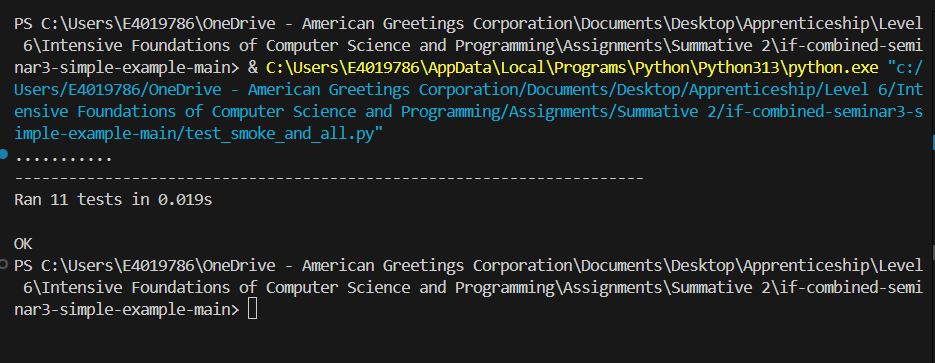
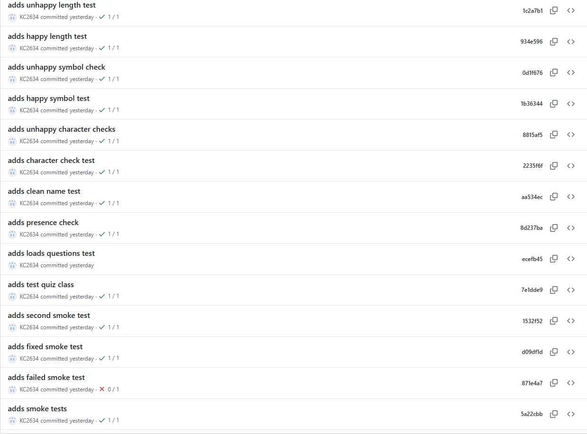

# Economic Quiz App

## Introduction

I work at UK Greetings, we supply greetings cards to retailers across the UK. I work in the Consumer Insight department where we look at how economic factors correlate to the greetings card market. Knowledge on what is happening in the UK economy is imperative for our team. There are lots of economic jargon used, this can be tricky to remember what each economic indicator measures. Therefore, I decided to develop an Economic Quiz app to test my team on economic measures.

Economic quiz app is a desktop application built using python and tkinter. The app asks the user for their name and deploys 3 questions with multiple choice answers where the user can choose the answer. It is not intended to be a teaching tool; rather a short quiz created to see what the user already knows and is only 3 questions long as our department is very fast paced so anything longer would not be useful.

Before submission, if any questions are not answered the app displays an error message. This is a key component for my app because some of my team are less technical, having this error message ensures they know all questions have been answered so they don’t have to retake the quiz. The user’s name is cleaned and checked against 4 validation functions, if any of the validations are not met another error message is displayed before the user can proceed. This ensures the data stored is clear and easy to read, which is important when creating visualisations. When all questions are answered and the name is valid, the name, date, time, score and selected answers are written to a CSV file. This storage format is used across the business and is easily accessible. 

My app focuses on the input collection, validation and storage, features such as data visualisation have not taken place at this stage. 

## Design
### GUI

Figure 1 shows the Figma wireframe used at the beginning of the design stage of my quiz. It demonstrates the intended user journey throughout the quiz. Starting at entering the user’s name and answers, to an error message being displayed. Then submitting their valid name and all answers. Then displaying the Thank you screen where their score is present, the user can press the quit button.

This Figma was used to display the screen layout, input validation and flow before implementation. It does not represent the final interface of the app; I adjusted based on the screen layout present with a laptop.


**Figure 1:** Wireframe

### Persona File

I created a persona file (Figure 2) to document an intended user, this allowed me to think further about the needs of the user. For example, I ensured my app was able to be displayed on a laptop screen as I know my intended user uses a laptop. This adheres to the user and business needs.


**Figure 2:** Persona File

### Functional and Non-functional Requirements
#### Functional Requirements


**Figure 3:** Functional Requirements

#### Non-functional Requirements


**Figure 4:** Non-functional Requirements

### Tech Stack Outline
•	Python 3 - programming language used.
•	Tkinter – desktop graphical user interface.
•	csv – local data storage.
•	re – regular expression for input validation.
•	datetime – timestamp generation.
•	unittest – automated unit testing.
•	message box – widget that allows user input for name.

### Code Design Document
This is a class diagram that demonstrates the relationship between the parent and child.


**Figure 5:** Class Diagram


## Development Section

I am going to display my development process as technical documentation as it delivers the same steps.

### Technical Documentation 

#### Introduction
This document outlines the specifications and requirements to run the Economic Quiz app. The application is a desktop GUI:
•	Loads questions from a CSV file.
•	Presents them on the GUI.
•	Validates the input.
•	Stores the data.

#### Intended user
The intended user are colleagues who need a quick review on economic metrics. Displaying the score gives real time feedback on performance so the user can practice on areas of improvement.

#### How to run the app
The Economic Quiz app requires Python 3 to run.
1.	Firstly, create the questions CSV file and use the format:
question,option_a,option_b,option_c,option_d,correct

This displays the question, answer options and the correct answer which should be displayed as a number between 0 and 3. To add more options, add ‘option_e’ after ‘option_d’.

You want to input your questions, answers and correct answers in this format making sure to not include unwanted spaces between the variables. Your CSV should look like Figure 6:

**Figure 6:** csv file

2.	Create the quiz_data module which loads questions from the CSV file and returns a list of question dictionaries. This is an important step as it groups your question elements, if question 1 was deleted the code would still run and display questions 2 and 3. Then import csv to read the file. Use:

```python
def load_questions(filepath="questions.csv"):
    
    """
    Load questions from questions CSV file and return a list of question dictionaries.

    This functions loads the questions from the 'questions' CSV file and turns them into a list of question dictionaries.
    The output depends on the contents of questions.csv, therefore it is not pure.
    If the file changes, the function returns different results for the same input.

    Parameters:
    filepath (str): The path to the questions CSV file.

    Returns:
    list: 
    -'question' (str): The text of the question.
    -'options' (list): A list of options A to D.
    -'correct' (int): The index of the correct answer (0-3).

    """
    
    questions = []

    with open(filepath, newline="", encoding="utf-8") as csvfile:
        reader = csv.DictReader(csvfile)
        for row in reader:
            questions.append({
                "question": row["question"],
                "options": [
                    row["option_a"],
                    row["option_b"],
                    row["option_c"],
                    row["option_d"],
                ],
                "correct": int(row["correct"])
            })

    return questions
```
If you added another answer option, you need to add this after ‘row["option_d"],’ in the same formatting but change to option_e.

3.	Create a main.py module and import tkinter as tk (following the tkinter documentation) for creating the GUI. Import the message box for the name input, import CSV to write the input data from main to a csv file. Then import the load_questions function from quiz_data:
   
```python
import tkinter as tk # imports tkinter for creating the GUI
from tkinter import messagebox # imports messagebox for name input
import csv # to write to csv from main
from quiz_data import load_questions # for loading the questions for the question screen
```

5.	Create EconomicQuizApp class:

```python
class EconomicQuizApp(tk.Tk):
    
    """
    A class that represents the economic quiz application.

    """
   
Creating the class allows you to bundle functions together that define the structure and behaviour of the objects it inherits. 

5.	The first function we define constructed all the necessary attributes for apps initial state such as background colour, display size, title and widgets.

```python
 def __init__(self, questions):
        """"
        Constructs all the necessary attributes for the app and name box.

        Parameters:
        self.name (str): The widget containing the user's name.
        self.questions (list): A list of dictionaries containing 'question' and 'options'.
        self.answer_vars (list): A list of tk.IntVar to store the user's chosen answers.

        """
```
The function is defined with ‘self’ which represents the object of the class, which allows the function to work for the class when the window is open. In this function create_name_label and pack this to the GUI so it appears on the display. Also build and pack the submit button.

6.	Builds the question screen of the app.
   
```python
def build_question_screen(self):
        
        """
        Builds the question section of the app.

        The function takes the questions from the quiz_data file and populates the screen with the question and the multiple answers available. 
        It asigns a questin number to the question and radio buttons for the answers. It also tracks the user responses

        Parameters:
        self.questions (list): A list of dictionaries containing 'question' and 'options'.
        self.answer_vars (list): A list of tk.IntVar to store the user's chosen answers.

        """

        question_number = 1

        for question in self.questions:
            q_label = tk.Label(
                self,
                text=f"Question {question_number}. {question['question']}",
                font=("Segoe UI", 18),
                wraplength=700,  # wrap the text if it's too long
                justify="center",
                fg = TEXT,  
                bg = BG
            )
            q_label.pack(anchor="w", padx=40, pady=(20, 5))

            answer_var = tk.IntVar(value=-1)
            self.answer_vars.append(answer_var)

            option_value = 0
            for option in question["options"]:
                rb = tk.Radiobutton(
                    self,
                    text=option,
                    variable=answer_var,
                    value=option_value,
                    font=("Segoe UI", 14),
                    fg = TEXT,
                    bg=BG
                )
                rb.pack(anchor="w", padx=60)
                option_value += 1

            question_number += 1
```
This function takes the questions dictionary from the quiz_data file and populates the screen with the questions and the answers. 
Using initializer of ‘question_number = 1’ which is starting value for the question numbers. Then using an f-string shows the question number to make the quiz easier to follow. Wrapping the text ensures all the questions fit on the display. Using a similar method, create my options_value variable which displays the options to the questions starting with 0. 
Finally for this function using the bottom line of code shows all the questions not just question 1.

7.	Create the handle_submit function which ensures all questions have been answered, counts the score and stores the users name, date, time, score and answers chosen to a csv file. Using the below code to create the skipped_questions error.

```python
skipped_questions = [i + 1 for i, var in enumerate(self.answer_vars) if var.get() == -1] 
        if skipped_questions:
            missing_str = ", ".join(map(str, skipped_questions))
            messagebox.showwarning(
                "Incomplete Quiz", 
                f"Please answer all questions before submitting. Missing questions: {missing_str}"
            )
            return
```
8.	For the code below, the print line is added so you can see that the data has successfully been written to the csv and there are no errors in the connection between the main module and the csv file. 

```python
with open("quiz_records.csv", mode="a", newline="", encoding="utf-8") as file:
                writer = csv.writer(file)
                writer.writerow([st_name, timestamp, self.score, answers])
                print("Data successfully written to CSV.") 
```


## Testing Section
Once I developed my app, I did testing to ensure all code is running correctly. I first did manual tests on the name input. I did this by manually inputting different names with different formats into the message box to see if the error message appeared. As seen in Figure 6 most tests passed but the length check did not pass, so I went into my quiz_utils folder and realised my minimum length was actually 0 so I changed that to 2. I tested again and it passed. The skipped question test failed, there was no error message in my main.py for this so I added the skipped_question code. Once added the test passed.

### Manual Testing


**Figure 7:** Manual Tests

Manual tests are not robust enough on their own to ensure code has no errors. So, I used Unit testing on my local computer to ensure my quiz_utils functions were correct. I first ran a smoke test that passed, then I ran a failing smoke test to ensure that didn’t pass so I knew the unittest was working. I then fixed that smoke test and carried out a series of test cases to verify my code is correct. I then used continuous integration on GitHub. I first created a .yml file in a workflows files. Then I uploaded my files to Github and used my test_smoke_and_all module to run my tests. I followed the same process of carrying out the smoke test first and then tested all my other quiz checks. Below are screenshots of all my passing and failing unittests from Github.

### Unit Testing


**Figure 8:** Local Unit Tests Passing


**Figure 9:** Unit Tests passing and failing in Github

## Documentation Section
### User Documentation
1.	To open the app, press the run python button in the main.py file.
2.	When the app appears on the screen, input your name in the message box. 
Your name cannot contain numbers, any punctuation other than hyphens.
It must be between 2 and 50 characters and cannot be blank.
If your name is outside these parameters an error message will display.
4.	Read question 1 and choose the correct answer from the 4 options. 
Only 1 answer is correct. 
5.	Then repeat for questions 2 and 3.
6.	Press the submit button. 
Make sure all questions are answered, or an error message will be displayed.
7.	Another screen will appear displaying your score out of 3.
8.	Press quit.

## Evaluation Section
A positive of my development was that it included an image of my company’s logo which adheres to my non-functional requirements and company needs. I would like to add the logo to all the screens, so it is more comprehensive and ensures the user knows the quiz relates to UKG. I would investigate more fonts using the tkinter website and read their documentation on how to install them. In the future I would like to test the app on my colleagues and get user feedback to see how the app could be user friendly and use their data to create visualisations.


